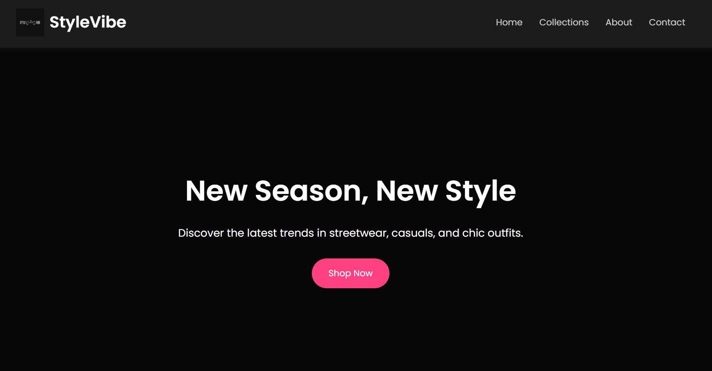

# StyleVibe 👗✨

**StyleVibe** is a modern fashion website built with HTML and CSS. It features a sleek, responsive dark theme perfect for showcasing streetwear, casual, and chic clothing collections.

---

## 🔥 Features

- ✨ Dark theme with elegant UI
- 📱 Responsive layout for mobile and desktop
- 🖼️ Hero section with call-to-action
- 🔗 Navigation bar and social links
- 🧢 Ideal for fashion brands or personal portfolios

---

## 🗂️ Project Structure
stylevibe/
├── index.html # Main HTML file
├── styles.css # Styling for layout and dark theme
├── logo.png # Brand logo
└── README.md # Project info

## 🌐 Live Preview

You can view the live site here:  
👉 [https://imyash-j.github.io/stylevibe](https://imyash-j.github.io/stylevibe)

(stylevibe-preview1.png)
